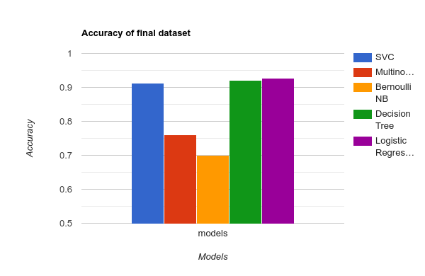

# Machine-Learning_Assignment:

Build a Machine Learning model which will automatically label your emails as per the labels 
defined by you. You must be familiar with the labelling feature of Gmail. You have to manually 
create labels (or use existing labels) for your email account and then manually label your 
emails. You are required to automate the process of labelling. You need not consider nested 
labels. Use 1-gram, 2-gram, and 3-gram language models to extract features from emails.

# Workflow

The aim of the assignment is to train ML models in order to classify emails into our defined labels and compare their accuracy. The attributes used for classification are the mail’s subject, sender and body. Following are the steps undertaken:

    1. Create a labelled dataset (CSV format) with emails from 6 categories namely:
        a. Course
        b. Clubs
        c. Important
        d. Outside (Not within the BITS Organisation)
        e. Personal
        f. Promotion
    2. Cleaning the dataset:
        a. Remove spaces and punctuation
        b. Remove stopwords
        c. Lemmatise the text
    3. N-gram Feature Extraction
        a. Use unigram, bigram and trigram
        b. Set a threshold of 0.1 i.e. 10% of all mails
    4. Pick out models for classification. The following models were used:
        a. Linear SVM
        b. Naive Bayes
            i. Multinomial
            ii. Bernoulli
        c. Decision Tree
        d. Logistic Regression
    5. Train the models with 80% of the labelled data and use the rest 20% for testing. Train and test 4 times with:
        a. All of our mails
    6. Compile results from all the models in form of graphs
    7. Make Observations
        a. The accuracy given by the models in decreasing order are:
            i. Logistic Regression: 91.9%
            ii. Decision Tree: 90.5% 
            iii. SVM: 90.1%
            iv. Naive Bayes (Multinomial) :77%
            v. Naive Bayes (Bernoulli): 70%

# Results of the model

  
  

